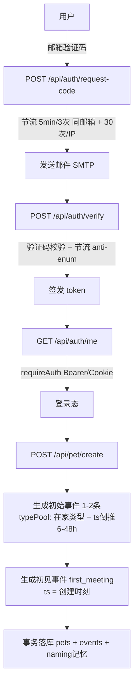
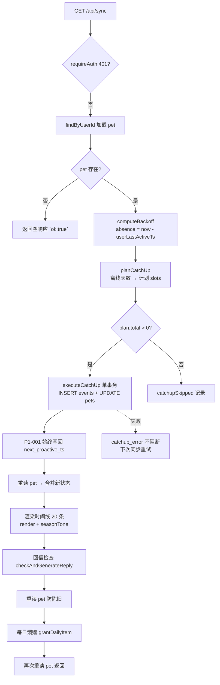
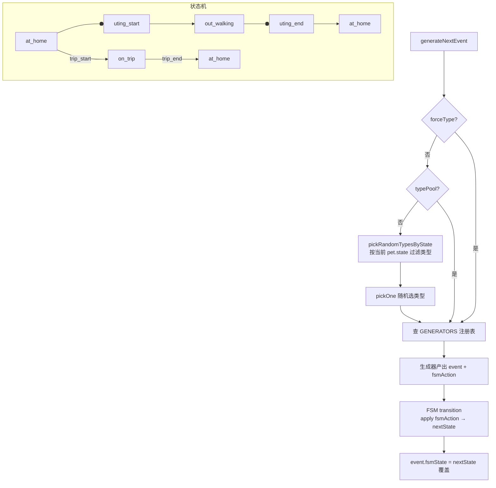
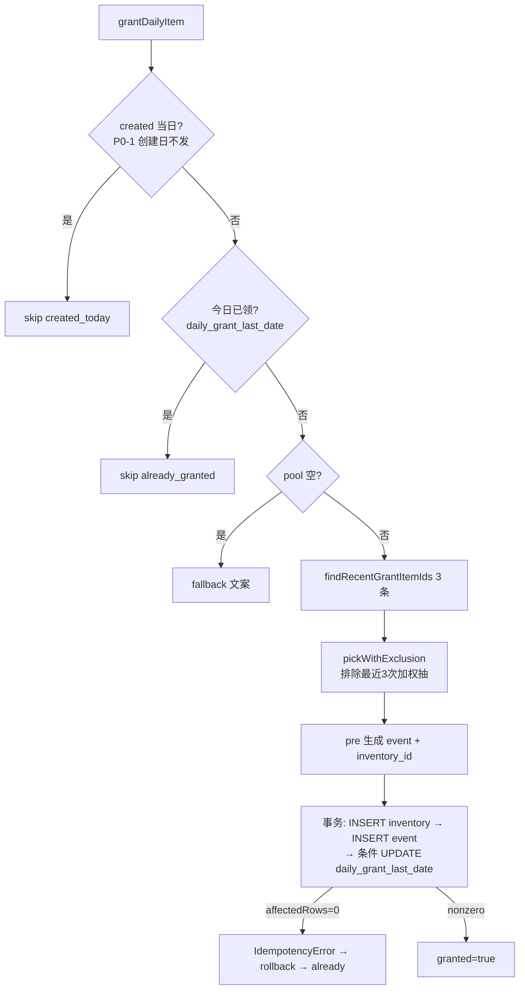
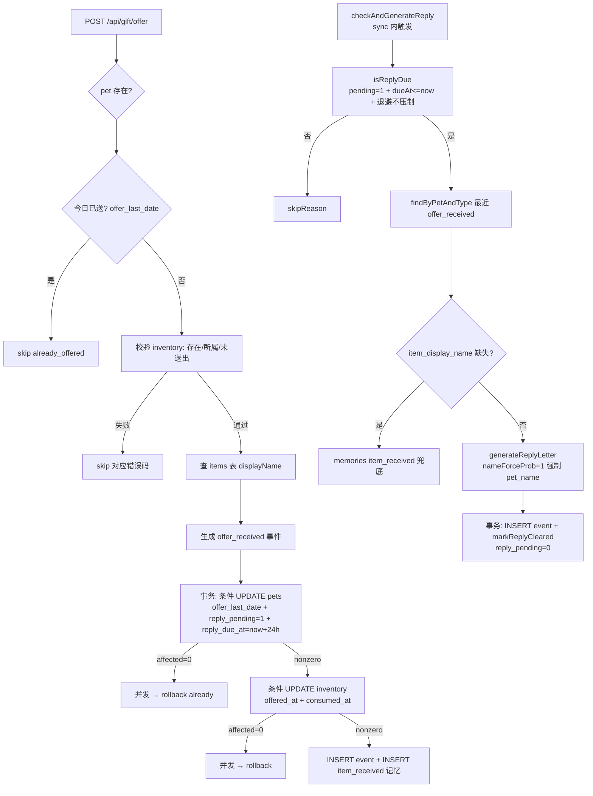
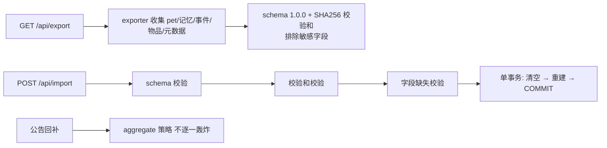

# Step 1 · 逻辑地图（完整审计）

**审计性质**：项目首次完整三步审计（领域逻辑层系统核查）
**审计时间**：2026-09-17
**依据**：`docs/requirements.md` §3（功能需求）、`docs/architecture.md`、128 个源文件代码通读
**方法**：code-audit 三步法 Step 1 —— 以「业务意图基准」绘制全景流程图，标注偏差高发区

---

## 0. 审计目标声明

本项目此前仅有：
- 阶段 5/6 QA 报告（验收导向）
- 09-12~09-13 接线专项审计（明确「不再重审领域逻辑」）

**本审计首次系统覆盖领域逻辑层**：事件引擎 / FSM / 补算 / 馈赠 / 送赠 / 回信 / 退避 / 记忆 / 素材包 / 导出导入 / 公告。

---

## 1. 全景流程图（6 条核心链路）

### 链路 A · 认证 + Pet 创建



### 链路 B · 主同步入口（核心）



### 链路 C · 补算（plan → exec → aggregate）

```mermaid
flowchart TD
    P1[planCatchUp 纯函数] --> P2{offlineMs > 0?}
    P2 -->|否| P3[空计划 total=0]
    P2 -->|是| P4[recentWindow = min(7天, offlineMs)]
    P4 --> P5[recentDays = floor(offlineMs/天) ≤ 7]
    P5 --> P6[normalCount = min(recentDays×1, 20-聚合1)]
    P6 --> P7[distributeTs 均匀分布<br/>首末留50% spacing]
    P7 --> P8{oldSpan > 0?<br/>离线>7天}
    P8 -->|是| P9[aggregate slot fromTs→oldEnd]
    P8 -->|否| P10[无聚合]
    E1[executeCatchUp] --> E2[事务 BEGIN]
    E2 --> E3[预取 memories 一次]
    E3 --> E4{naming 记忆缺失?}
    E4 -->|是| E5[补插 naming 记忆]
    E4 -->|否| E6[逐条 forceType 生成 + INSERT<br/>FSM 逐步推进]
    E6 --> E7{plan.aggregate?}
    E7 -->|是| E8[generateAggregateSummaryEvent<br/>ts = recentStart 窗口起点]
    E7 -->|否| E9[UPDATE pets<br/>state/state_since/last_activity/user_last_active/offline_start]
    E5 --> E6
    E8 --> E9
    E9 --> E10[事务 COMMIT / 失败 ROLLBACK]
```

### 链路 D · 事件引擎 + FSM



### 链路 E · 每日馈赠闭环



### 链路 F · 送赠 + 回信



### 链路 G · 导出/导入 + 公告（简述）



---

## 2. ⚠️ 偏差高发区标注（Step 2 待推演）

| ID | 位置 | 风险描述 | 级别猜测 |
|----|------|---------|---------|
| **H-A** | `pet-fsm.ts:40` | `transition()` 对 no-op / 非法动作**也返回 `stateSince: now`**——状态未变但起始时间被推进。补算中连续 no-op 事件会把 state_since 反复推到最新事件时间，UI「状态于 X 起」可能失真 | 🟠 语义疑点 |
| **H-B** | `planner.ts CANDIDATE_TYPES` + `engine.ts forceType` | planner 直接随机抽类型（含 outing、brought_item）后以 `forceType` 绕过引擎的**状态过滤**。pet 在 `out_walking` 时抽到 outing → 生成「又出门」事件但 FSM no-op；`at_home` 抽到 brought_item → 出现「没出门却带回物品」孤立事件 | 🟠 语义矛盾 |
| **H-C** | `brought-item.ts` fsmAction=outing_end | 生成器无条件声明 `outing_end`，非法时被 FSM 降级 no-op，但**事件仍入库**。补算随机路径下「带物品回家」事件可能成为异常状态（与需求「带回物品=散步归来」矛盾） | 🟡 轻微 |
| **H-D** | `sync route.ts` 顺序 | 时间线查询在回信/馈赠**之前**，本次响应 events 不含刚生成的 reply/grant 事件（欢迎卡数据独立返回，前端需下次刷新才见事件） | 🟡 体验/设计 |
| **H-E** | `daily-grant.ts created_today` | 判据用 `toLocalDateStr(createdAt)===todayStr`；若用户在 23:59:59 创建、次日 00:00:01 登录 → 同日 UTC+8 字符串不同，发放正确；但 UTC+8 与服务器本地时区若不一致（部署在非 +8 主机），`toLocalDateStr` 偏移需确认 | 🟡 边界 |
| **H-F** | `reply.ts findLatestOfferEvent` | 用「最近一条 offer_received」反推 reply 关联物品。若用户曾多次送赠但 reply 未清，或 offer 事件 ts 与 pending 记录错位，回信可能引用**错误物品** | 🟠 待验证 |
| **H-G** | `executor.ts` 聚合事件 ts | aggregate.ts = oldEnd（= recentStart 窗口起点），而 normal 首条 ts 略大于 recentStart（spacing 边距）。若调用方依赖 `generated` 数组顺序而非按 ts 排序，聚合会跑到「更早」位置；需确认 DB 查询排序 | 🟡 轻微 |
| **H-I** | `season.ts stableHash % lines.length` | 确定性依赖 lines 数组**长度与内容不变**；若素材包更新后 lines 变化，同一事件渲染结果漂移（与「永远同一条」承诺冲突） | 🟡 轻微 |
| **H-J** | `sync` 失败吞异常 | catchup/reply/grant 三处失败都仅 console.error 不阻断；若 DB 故障，用户会收到「看似成功但数据缺失」的时间线 | 🟡 可接受性 |

---

## 3. 与需求基准的宏观比对结论（初判）

| 需求 § | 实现 | 初判 |
|--------|------|------|
| §3.2 状态机 | 三态 FSM + 非法动作 no-op | ✅ 结构符合 |
| §3.3 事件引擎 ≥30% 名字 / 退避 | recall-strategy 强制注入 50%、退避 band 表 | ✅ 有冗余设计 |
| §3.4 补算 ≤20 / >7 天聚合 / 状态推进 / 渐进披露 | planner 上限 20、7 天窗口、聚合摘要、offlineStartTs | ✅ 结构符合（H-A/H-B/G 待推演） |
| §3.7 馈赠加权+排除3次 / 24h 回信 | item-pool 加权排除、reply_due 24h | ✅（H-D/F 待推演） |
| §3.9 导出导入 | schema+校验和+单事务 | ✅ 接线审计已核 |
| §3.10 素材包损坏回退 | loader fallback | ✅ 待抽查 |
| §3.11 事件-素材契约 | packs-contract 冻结 | ✅ 待抽查 |

> **请确认**：以上 7 条链路走向与您的业务意图是否一致？特别是 H-B/H-C（补算中随机事件类型与 FSM 状态可能产生的「语义矛盾事件」）——这是否是您预期的产品行为？确认后我将进入 Step 2 极端推演。