# Step 1 · 逻辑地图（链路审计）

> 审计性质：**integration-gap 专项**（核对"验收绿、产品断线"类问题）
> 审计时间：2026-09-12
> 依据：`docs/requirements.md` §6、`docs/acceptance-runbook.md`、前端 fetch 全量扫描、API 目录、领域层关键模块
> 方法：code-audit 三步法 Step 1 —— 11 项验收逐条映射「真实用户路径（页面 → API → 领域 → DB）」

---

## 1. 接线全景（11 项验收 × 真实用户路径）

```mermaid
flowchart TD
    subgraph 前端页面
      LOGIN[/login/] --> CREATE[/create-pet/]
      HOME[/首页/] --> PROF[/profile/]
      HOME --> TIMELINE[/timeline/]
      HOME --> GIFTS[/gifts/]
      HOME --> SET[/settings/]
      HOME --> ANN[/announcements/]
      LETTER[/letter/] --> PROF
      EXPORT[/export/] --> IMP[/import/]
      SET --> HELP[/account/help/]
      SET --> DEV[/developer/]
    end

    subgraph API 层
      A1[POST /api/auth/request-code]
      A2[POST /api/auth/verify]
      A3[POST /api/pet/create]
      A4[GET /api/sync]
      A5[GET /api/pet/timeline]
      A6[GET /api/inventory]
      A7[POST /api/gift/offer]
      A8[GET /api/letters]
      A9[GET /api/announcements]
      A10[POST /api/announcements/admin]
      A11[GET /api/export]
      A12[POST /api/import]
      A13[GET /api/packs]
      A14[POST /api/packs/activate]
      A15[GET /api/profile]
      A16[POST /api/pet/generate-event]
      A17[POST /api/auth/logout]
      A18[POST /api/gift/daily]
      A19[GET /api/healthz]
      A20[GET /api/auth/me]
    end

    LOGIN --> A1 & A2
    CREATE --> A3
    HOME --> A5 & A16
    HOME --> A4
    TIMELINE --> A5 & A4
    GIFTS --> A6 & A7
    LETTER --> A8
    ANN --> A9
    SET --> A17
    EXPORT --> A11
    IMP --> A12
    DEV --> A13 & A14
    PROF --> A15
    HELP --> A15

    A18 -.未有前端调用.-> NONE[无 UI/无调用]
```

## 2. 各项验收接线结论

| # | 验收项 | 用户路径 | 接线状态 | 判定 |
|---|--------|----------|----------|------|
| 1 | 注册登录（含安全边界） | /login → /create-pet → 首页；/settings 退出 | 完整 | ✅ |
| 2 | 档案页 | 首页 nav → /profile → GET /api/profile | 完整 | ✅ |
| 3 | 随机事件引擎 | 首页测试按钮 → generate-event（开发端点） | **生产 403，见 H1**；"低频随机"只靠补算/初始事件产生（设计如此）| ⚠️ |
| 4 | 补算 | 首页/时间线首载 → GET /api/sync（**今日已接线**）| 1 天场景通；3/30 天需造数据，手册称「开发者页可调」**实际无此工具**，见 H3 | ⚠️ |
| 5 | 事件流 | /timeline → GET /api/pet/timeline | 完整 | ✅ |
| 6 | 公告 | /announcements（列表/已读/静音/聚合展开）；发布走 admin API+token（无 UI，管理员工具可接受）| 完整 | ✅ |
| 7 | 导出/导入 | /settings → /export（确认弹窗）→ /import；/account/help 引用 | 完整（用户已验导出；导入未验）| ✅ |
| 8 | 素材包切换 | /developer → GET /api/packs + POST /api/packs/activate；损坏回退引导 | 完整（**无 ENABLE_DEV_ENDPOINTS 门控**，生产亦可访问，见 H6 建议）| ✅ |
| 9 | 部署 + 性能 | build/smoke/healthz | 完整 | ✅ |
| 10 | 每日馈赠闭环 | sync 自动发放 → /gifts 送 pet → /letter 回信 | 自动发放无 UI 提示、手动兜底端点无调用，见 **H2** | ⚠️ |
| 11 | 账号安全与恢复 | /account/help 申诉入口；节流/过期领域层 | 完整 | ✅ |

## 3. 偏差高发区（⚠️）

### H1 🔴 首页开发工具按钮在生产环境永远 403
- **位置**：`src/app/page.tsx`「开发工具（阶段 2 演示）」区块——「随机触发一次」+ 6 个类型按钮
- **现状**：注释写"仅非生产模式"，但**代码没有任何 `NODE_ENV` 隐藏逻辑**；`ENABLE_DEV_ENDPOINTS` 门控只存在于 `/api/pet/generate-event` 一个接口
- **影响**：正式部署（NODE_ENV=production，未显式开白名单）后，每个登录用户打开首页都看到一排失效按钮，点击报 403
- **修复候选**：按 `process.env.NODE_ENV !== "production"` 条件渲染隐藏；或页面与 API 统一走 dev 端点白名单

### H2 🟠 每日馈赠无感知（验收 10 与实现不符）
- **现状**：馈赠在 `/api/sync` 内自动发放（`grantDailyItem`）进物品栏——符合需求 §3.7「首次登录 → 自动奖励」；但
  - 首页**没有任何「今日馈赠」到账提示 / 领取入口**（验收手册 10 第 1 步"首页出现今日馈赠→领取"无法复现）
  - `POST /api/gift/daily`（手动兜底端点）**无任何前端调用**
- **影响**：新用户首次登录拿到物品完全无感知；功能链路通但**用户感知链路断**
- **修复候选**：首页加"今日馈赠已到账"轻提示（进 /gifts 查看），或同步响应携带 granted 信息做一次性 toast，并接一个领取兜底入口

### H3 🟡 验收 4 的 3天/30天场景："开发者页可调"不成立
- **现状**：验收手册 4 写"开发者页可调（活跃时间），或直接改 DB"；**developer 页没有调整活跃时间的任何工具**，只能手动改 `pets.last_activity_ts`/`user_last_active_ts`
- **影响**：手册描述与 UI 不符；造"离线 3/30 天"验收条件成本高、易误操作
- **修复候选（可选）**：developer 页加"把活跃时间拨回 N 天前"的测试工具（仅 dev 白名单内可用）

### H4 ✅ 补算前端接线（本轮已修复）
首页 `load()` 与时间线首载前置 `runSyncOnce()` → `GET /api/sync`；模块级 in-flight 去重 + 幂等（offlineMs≤0 不生成事件）。

### H5 🟠 验收 3 的"随机事件流"在产品链路中无自然发生面
- **现状**：随机事件只在 初始创建（1-3 条）与 补算（登录同步时）生成；MVP 无后台定时生成器（设计如此，需求 §3.4 终点就是"下次同步时补算"）
- **影响**：验收 3"抽样 ≥10 条事件文案"实际只能通过制造补算来采样；产品上线后长期不登录的用户打开首页，事件流由补算一次性补齐——与"pet 一直在过日子"的等效体验一致，**非缺陷**，但验证手段依赖造数据，建议验收说明中注明

### H6 🟡 /developer 与 /api/packs/activate 无 dev 门控
- 素材包切换是"同一中心可切换"的正式功能（需求 §3.10），页面放开发者入口合理；但**任意登录用户可直达** /developer 观看包信息、切换主题。MVP 单中心小范围可接受，标注为建议项

## 4. 待用户确认的问题

1. **H1 三大候选**（生产隐藏按钮）是否确认要修？倾向哪一种（按 NODE_ENV 条件渲染 还是 统一白名单）？
2. **H2 馈赠提示**：加"到账提示"是否符合产品预期（需求只说自动进物品栏，未要求提示；但验收手册写了"首页出现今日馈赠"）？还是按需求原文为准、只修验收手册描述？
3. **H3 开发者调时工具**：是否需要？（验收 4 的 3/30 天场景用改 DB 方式是否可接受？）
4. 除上述外，逻辑地图中是否有与你的业务意图不符的分支？

> 确认后进入 **Step 2 反向验证**（针对 H1/H2/H3 设计极端场景，逐行推演执行路径）。